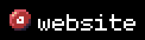

Hi, I'm Max! (also known as @axseem) 👋

Here you'll find some of the projects I'm working on. To learn more about me, check out my website: [axseem.me](https://axseem.me)

# Software

- **[dirmd](https://github.com/axseem/dirmd)** —  Bundle directories into a single Markdown file.
- **[pixv](https://github.com/axseem/pixv)** — Vectorize your pixel art.
- **[website](https://github.com/axseem/website)** — My site with a blog, projects, public diary, gallery and more.

# Hardware

- **[Anywhy Flake](https://github.com/anywhy-io/flake)** — Ultra-thin, minimalistic, ergonomic keyboard with 40, 46 or 58 key layout.