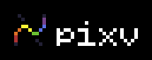
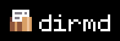
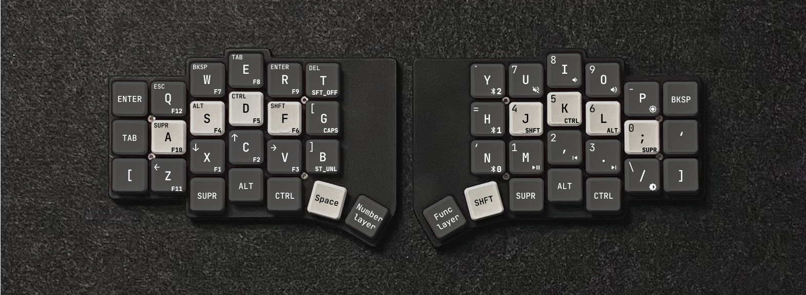

Hi, I'm Max! (also known as axseem)

Here you'll find some of the projects I'm working on. To learn more about me, check out my website: [axseem.me](https://axseem.me)

# Software

- **[pixv](https://github.com/axseem/pixv)** - Vectorize your pixel art.
- **[dirmd](https://github.com/axseem/dirmd)** - Bundle directories into a single Markdown file.

# Hardware

- **[Anywhy Flake](https://github.com/anywhy-io/flake)** - An ultra-thin, minimalist, ergonomic keyboard with 40, 46, or 58-key layouts.